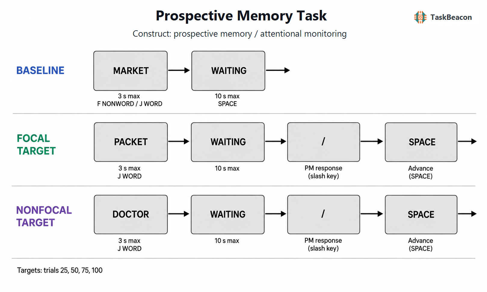

# 事件型前瞻记忆的焦点性效应：实验逻辑、认知机制与 TaskBeacon 实现

前瞻记忆（prospective memory, PM）指个体在适当的未来情境中提取既定意图并执行相应行动的能力。其核心测量困难在于，意图形成后通常没有外显的回忆提示，个体还须持续完成另一项进行中任务。因此，成功反应同时依赖意图保持、目标事件识别、意图内容提取以及行动切换；单一的命中率无法直接指认其中任一过程。事件型前瞻记忆范式把低频目标线索嵌入连续进行中任务，并以线索焦点性操纵进行中加工与目标识别所需加工是否重合，从而检验意图能否由线索自发唤起，以及何时需要资源依赖的策略性监控。该范式已成为区分自发提取与策略性监控的重要实验工具，也为认知老化、临床评估和神经机制研究提供了可控的任务模型。

## 1. 范式提出与理论背景

Einstein 和 McDaniel（1990）建立了具有广泛影响的实验室事件型前瞻记忆范式：参与者先形成“遇到某类未来事件时执行额外动作”的意图，随后在持续进行的认知任务中等待目标出现。该设计把前瞻成分——在正确时机意识到需要行动——与回溯成分——记住应执行何种行动——纳入同一试次，同时可用目标命中、错误反应及进行中任务表现描述意图执行。与直接要求回忆的回溯记忆测验相比，这一嵌入式结构保留了自我发起提取的要求。

关于目标出现前是否必须持续投入注意，准备性注意与记忆过程观点强调意图保持和目标检查会占用容量，因而加入前瞻记忆要求应使进行中任务减慢或准确率下降（Smith, 2003）。多过程观点则认为，提取方式取决于目标线索、进行中任务、意图重要性和个体状态：策略性监控与相对自发的线索触发均可支持意图实现（McDaniel & Einstein, 2000; Einstein et al., 2005）。由此产生的关键操作是线索焦点性。若进行中任务本身要求加工目标的定义特征，例如在词汇判断中识别特定单词，目标属于焦点线索；若目标要求额外检查未被进行中任务必然加工的特征，例如检查单词内部的特定字母组合，则属于非焦点线索。焦点线索较可能触发自发提取，非焦点线索通常增加主动监控需求，但这种对应关系是概率性的，不能据一次反应直接判定参与者采用了何种策略（McDaniel et al., 2015; Rummel & Kvavilashvili, 2023）。

焦点性的操作定义经历了进一步澄清。早期研究常同时改变线索与进行中任务的加工适配性以及线索的特异程度，例如把一个特定词与一类字母组合进行比较。Lyon 和 Hicks（2023）表明，“任务适配/不适配”与“特定/一般线索”是可分离属性。因而，焦点—非焦点差异只有在刺激集合、目标频率、线索显著性和反应规则得到控制时，才适合解释为加工重合程度的效应。

## 2. 任务逻辑、流程与核心指标

标准事件型前瞻记忆实验包含意图编码、延迟保持、进行中任务、目标检测与行动执行。参与者先学习目标—行动联结，经过填充活动或延迟后开始进行中任务；目标以低概率夹杂于普通试次。普通试次要求完成进行中判断，目标试次还要求执行预先约定的前瞻动作。正式阶段通常不给予逐试次前瞻记忆反馈，以免重新提示意图或改变后续监控。焦点与非焦点条件可采用组间设计，也可在区组内或区组间进行被试内比较；被试内设计提高统计效率，但需要平衡顺序并考虑策略迁移。

该范式的主要因变量包括目标命中率、遗漏率、非目标试次上的虚报率、进行中任务准确率和反应时。前瞻记忆成本通常定义为前瞻记忆区组与纯进行中任务基线之间的反应时或准确率差异；它反映加入意图后对当前任务的干扰。目标命中比较更接近线索检测与行动执行的联合结果，进行中成本比较更接近意图保持、目标预期和反应阈值调整的综合影响。目标后的独立行动窗口可减少前瞻动作与进行中反应之间的运动竞争，但仍不能分离“注意到线索”与“成功回忆行动”两个潜在成分。

焦点条件与非焦点条件的理论对比须落到具体阶段。目标出现前的普通试次用于估计监控相关成本；目标试次相对于匹配普通试次的差异用于考察线索检测和意图提取；目标上的前瞻动作及其时延反映检测后协调与执行。焦点目标命中高于非焦点目标、且焦点区组成本较小的组合，与较多自发提取相容。非焦点区组成本增加并伴随命中改善，与策略性监控相容。然而，成本为零也可能源于监控间歇化、反应策略变化或测量灵敏度不足，不能作为无监控的充分证据。

## 3. 主要行为与神经科学发现

### 3.1 线索检测、监控成本与个体差异

Brewer 等（2010）在词汇判断中比较特定单词目标与单词内部字母串目标，发现工作记忆容量与非焦点条件成绩相关，而不同容量组在焦点条件中的表现相近，支持受控注意对非焦点检测更为重要。Scullin 等（2010）进一步区分监控难度与加工焦点性：即使两类线索的监控难度相近，进行中任务是否自然加工目标特征仍会改变前瞻记忆表现。焦点优势因此不能简化为目标更容易看见。

进行中成本提供了重要但非特异的过程指标。跨研究元分析显示，目标数量、线索焦点性、目标显著性、进行中任务类型与试次上下文都会调节成本，命中率和成本也不必同步变化（Anderson et al., 2019）。眼动研究进一步发现，相似的反应时成本可对应早而频繁或晚而稀疏的不同检查方式；加入注视指标后，对前瞻记忆正确率的预测优于仅使用反应时成本（Koslov et al., 2022）。近期允许参与者主动查询目标出现概率的研究也显示，情境信息会提高前瞻记忆成绩并增加进行中成本，非焦点线索引发更频繁的概率查询（Laera et al., 2025）。这些结果支持监控资源的动态配置，并限制了把区组平均反应时直接等同于持续监控强度的解释。

### 3.2 EEG 与 fMRI 所揭示的阶段差异

事件相关电位（event-related potential, ERP）有助于区分线索加工的时间进程。Cona 等（2014）观察到，非焦点条件在普通试次上表现出更强的额—顶调制，并在目标试次上出现更大的 prospective positivity 和额部慢波，分别与目标后意图提取及执行协调相联系；焦点目标上的 FN400 增强则与较快速的熟悉性或线索触发加工相容。上述头皮信号支持非焦点任务募集更多控制资源，但 ERP 的空间来源以及各成分对应的单一心理过程均不能由头皮分布单独确定。

功能磁共振成像（functional magnetic resonance imaging, fMRI）证据显示，焦点性影响的是监控和提取所依赖的网络配置。激活似然估计元分析发现，非焦点意图提取较一致地涉及左侧前额极区域，而焦点提取更多涉及腹侧顶叶和小脑区域；共同网络及任务差异同时存在（Cona et al., 2016）。一项较新的 fMRI 研究把焦点性与同时保持的意图负荷结合，发现高负荷目标检测主要调动左侧顶内沟，低负荷时非焦点相对于焦点的差异更多出现在腹侧枕颞区域，提示负荷可改变焦点性效应的神经表达（Cantarella et al., 2023）。该研究最终样本量较小，且多重意图之间存在优先级竞争，结果适合用于说明网络随任务要求变化，尚不足以建立脑区与特定提取方式之间的一一对应或因果关系。

## 4. 范式发展与主要应用

焦点性操纵显著推进了认知老化研究。对 4,709 名参与者、117 个效应量的元分析显示，老年组在非焦点事件型任务中的下降大于焦点任务，但焦点条件同样存在可靠年龄差异（Kliegel et al., 2008）。这说明环境支持可以减轻自我发起加工需求，却不能保证年龄效应消失。临床研究进一步把事件型前瞻记忆用于轻度认知障碍和阿尔茨海默病。近期系统综述与元分析汇总 46 项研究，确认两类临床群体均存在前瞻记忆受损，同时指出事件型与时间型任务、延迟长度、评分方法和疾病阶段的异质性会影响效应大小（Román-Caballero & Mioni, 2025）。实验室焦点性效应可用于提出过程假设，不宜单独作为疾病筛查或个体诊断依据。

方法学发展的另一方向是提高真实情境代表性。自然环境中的意图通常由个体自行形成，可使用提醒，并与多项活动交织；实验室任务则多采用实验者指定、目标稀少且反应方式固定的意图。自我报告与实验室表现之间通常只有较弱或不稳定的收敛关系，虚拟现实和情境化测验虽扩展了行为范围，也引入更多无法严格控制的成分（Blondelle et al., 2022）。因此，词汇判断范式适合检验线索加工与监控理论，其分数对日常服药、赴约或多任务活动的外推仍需自然情境指标或纵向结局支持。

## 5. 测量效度与解释边界

事件型前瞻记忆任务可稳定产生群体平均的焦点性和进行中成本效应，但个体差异测量更为困难。Kelemen 等（2006）报告，传统低目标数任务的复本信度仅为 *r* = .31；增加目标数量并避免接近满分可改善信度。每个条件只有少量目标时，单次遗漏即可造成较大的命中率变化，二项分数还容易出现天花板或地板效应。研究若以个体排序、临床分类或相关分析为目标，应增加可评分事件、采用分层或试次级模型，并预先规定对超时、虚报和进行中错误的处理。

构念效度还受三类混淆限制。第一，特定词与字母组合的比较同时改变加工适配性、线索集合大小和视觉结构，所得差异不能全部归于自发提取。第二，前瞻记忆成本混合了目标检查、意图保持、反应谨慎化和决策延迟；较高成本并不必然意味着更有效监控。第三，目标命中要求检测线索、回忆意图和执行动作连续成功，低命中无法定位失败阶段。结合目标后的意图回忆、眼动或 ERP 指标，或使用多项式加工树等模型，能够提高过程可识别性。

基线与条件顺序也影响解释。纯进行中基线若总在前，练习、疲劳和后续区组中的任务集变化可能进入成本估计；被试内焦点—非焦点区组虽经顺序平衡，前一区组形成的检查策略仍可能迁移。近期理论综述指出，不同前瞻记忆理论往往针对特定实验结构发展，单一范式内的支持不必然推广到时间型、自主形成或长期延迟意图（Rummel & Kvavilashvili, 2023）。严谨研究应把结论限定为所用线索、进行中任务、延迟和反应规则下的过程差异。

## 6. TaskBeacon 中的任务实现

### 6.1 任务资源与访问入口

| 资源 | ID | 用途 | 地址 |
|---|---|---|---|
| TaskBeacon 完整任务源码 | T000077 | 行为实验的本地运行与方法复核 | [GitHub 仓库](https://github.com/TaskBeacon/T000077-prospective-memory-task) |

当前仓库将该范式实现为行为采集任务，中文指导语配合英文大写词与可发音非词。实验先含 10 个词汇判断练习试次和 105 个无前瞻意图的基线试次，随后呈现焦点与非焦点两个 105 试次区组；两区组顺序按三位数参与者编号奇偶平衡。每个前瞻记忆区组在意图指导后安排 120 秒嵌入图形干扰，目标固定出现在第 25、50、75 和 100 试次。该实现无自适应控制，填充刺激由固定种子生成。

**图 1. TaskBeacon 事件型前瞻记忆试次流程。** 每个试次先呈现英文词或非词，最长 3 秒；参与者以 `J` 判断单词、以 `F` 判断非词。随后进入最长 10 秒的 `WAITING` 阶段。基线及普通试次以空格键进入下一试次；焦点目标为精确词项 `PACKET`，非焦点目标为含字母组合 `TOR` 的单词（如 `DOCTOR`），两类目标均要求在随后的 `WAITING` 阶段按 `/`。按 `/` 后仍显示 `WAITING`，参与者须在最长 10 秒内按空格键继续。目标试次按 `/` 计为命中，未按计为遗漏；非目标试次按 `/` 计为虚报，前瞻记忆评分与先前词汇判断正误分别记录。仅练习试次在词汇判断后呈现 0.6 秒正确/错误反馈；正式试次无反馈，流程不采用自适应难度调整。

该实现记录焦点与非焦点目标的命中和遗漏、非目标虚报、词汇判断正确率与反应时，以及 `WAITING` 阶段的反应键和时延。前瞻动作被安排在词汇判断后的中性屏幕，使进行中反应与意图执行在时间和按键上分离。分析时可分别估计两类目标完成率，并以各前瞻记忆区组普通试次相对于基线的词汇判断变化表示进行中成本。每个区组仅含 4 个目标，条件命中率的最小步长为 25%，更适合群体水平的实验比较；用于个体评估时需增加重复测量或采用更高信息量的设计。

## 参考文献

Anderson, F. T., Strube, M. J., & McDaniel, M. A. (2019). Toward a better understanding of costs in prospective memory: A meta-analytic review. *Psychological Bulletin, 145*(11), 1053–1081. https://doi.org/10.1037/bul0000208

Blondelle, G., Sugden, N., & Hainselin, M. (2022). Prospective memory assessment: Scientific advances and future directions. *Frontiers in Psychology, 13*, 958458. https://doi.org/10.3389/fpsyg.2022.958458

Brewer, G. A., Knight, J. B., Marsh, R. L., & Unsworth, N. (2010). Individual differences in event-based prospective memory: Evidence for multiple processes supporting cue detection. *Memory & Cognition, 38*(3), 304–311. https://doi.org/10.3758/MC.38.3.304

Cantarella, G., Mastroberardino, S., Bisiacchi, P., & Macaluso, E. (2023). Prospective memory: The combined impact of cognitive load and task focality. *Brain Structure and Function, 228*(6), 1425–1441. https://doi.org/10.1007/s00429-023-02658-3

Cona, G., Bisiacchi, P. S., & Moscovitch, M. (2014). The effects of focal and nonfocal cues on the neural correlates of prospective memory: Insights from ERPs. *Cerebral Cortex, 24*(10), 2630–2646. https://doi.org/10.1093/cercor/bht116

Cona, G., Bisiacchi, P. S., Sartori, G., & Scarpazza, C. (2016). Effects of cue focality on the neural mechanisms of prospective memory: A meta-analysis of neuroimaging studies. *Scientific Reports, 6*, 25983. https://doi.org/10.1038/srep25983

Einstein, G. O., & McDaniel, M. A. (1990). Normal aging and prospective memory. *Journal of Experimental Psychology: Learning, Memory, and Cognition, 16*(4), 717–726. https://doi.org/10.1037/0278-7393.16.4.717

Einstein, G. O., McDaniel, M. A., Thomas, R., Mayfield, S., Shank, H., Morrisette, N., & Breneiser, J. (2005). Multiple processes in prospective memory retrieval: Factors determining monitoring versus spontaneous retrieval. *Journal of Experimental Psychology: General, 134*(3), 327–342. https://doi.org/10.1037/0096-3445.134.3.327

Kelemen, W. L., Weinberg, W. B., Alford, H. S., Mulvey, E. K., & Kaeochinda, K. F. (2006). Improving the reliability of event-based laboratory tests of prospective memory. *Psychonomic Bulletin & Review, 13*(6), 1028–1032. https://doi.org/10.3758/BF03213920

Kliegel, M., Jäger, T., & Phillips, L. H. (2008). Adult age differences in event-based prospective memory: A meta-analysis on the role of focal versus nonfocal cues. *Psychology and Aging, 23*(1), 203–208. https://doi.org/10.1037/0882-7974.23.1.203

Koslov, S. R., Bulls, L. S., & Lewis-Peacock, J. A. (2022). Distinct monitoring strategies underlie costs and performance in prospective memory. *Memory & Cognition, 50*(8), 1772–1788. https://doi.org/10.3758/s13421-022-01275-5

Laera, G., Del Missier, F., Laloli, S., Zuber, S., Kliegel, M., & Hering, A. (2025). Looking for cues over time: A study on self-initiated monitoring in event-based and time-based prospective memory. *Memory & Cognition, 53*(7), 2094–2110. https://doi.org/10.3758/s13421-025-01700-5

Lyon, B. A., & Hicks, J. L. (2023). A thorough examination of cue specificity and task-appropriateness in defining focal and nonfocal prospective memory tasks. *Memory, 31*(5), 665–677. https://doi.org/10.1080/09658211.2023.2187335

McDaniel, M. A., & Einstein, G. O. (2000). Strategic and automatic processes in prospective memory retrieval: A multiprocess framework. *Applied Cognitive Psychology, 14*(7), S127–S144. https://doi.org/10.1002/acp.775

McDaniel, M. A., Umanath, S., Einstein, G. O., & Waldum, E. R. (2015). Dual pathways to prospective remembering. *Frontiers in Human Neuroscience, 9*, 392. https://doi.org/10.3389/fnhum.2015.00392

Román-Caballero, R., & Mioni, G. (2025). Time-based and event-based prospective memory in mild cognitive impairment and Alzheimer’s disease patients: A systematic review and meta-analysis. *Neuropsychology Review, 35*(1), 102–125. https://doi.org/10.1007/s11065-023-09626-y

Rummel, J., & Kvavilashvili, L. (2023). Current theories of prospective memory and new directions for theory development. *Nature Reviews Psychology, 2*(1), 40–54. https://doi.org/10.1038/s44159-022-00121-4

Scullin, M. K., McDaniel, M. A., Shelton, J. T., & Lee, J. H. (2010). Focal/nonfocal cue effects in prospective memory: Monitoring difficulty or different retrieval processes? *Journal of Experimental Psychology: Learning, Memory, and Cognition, 36*(3), 736–749. https://doi.org/10.1037/a0018971

Smith, R. E. (2003). The cost of remembering to remember in event-based prospective memory: Investigating the capacity demands of delayed intention performance. *Journal of Experimental Psychology: Learning, Memory, and Cognition, 29*(3), 347–361. https://doi.org/10.1037/0278-7393.29.3.347
